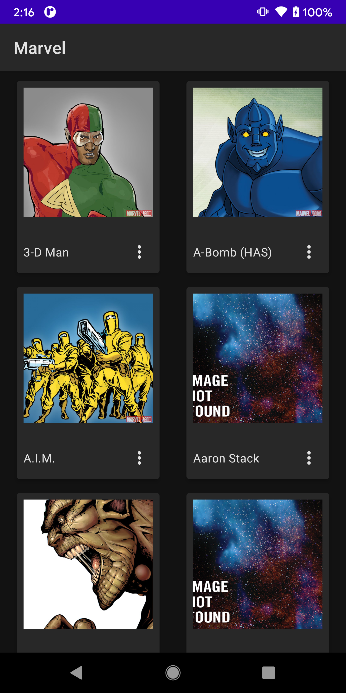

# MarvelApp
Just an app to get Data from Marvel chars to put in practice JetpackCompose and other stuff..

Happy coding (•̀ᴗ•́)و ̑̑

### Main Screen

### Summary Screen

### Detail Screen

## Android Libraries
1. Jetpack Compose (Google UI)
2. Dagger Hilt (Dependency Injection)
3. Retrofit (REST API)
4. Coil (Image Rendering)
5. Kotlin Coroutines for Async work

